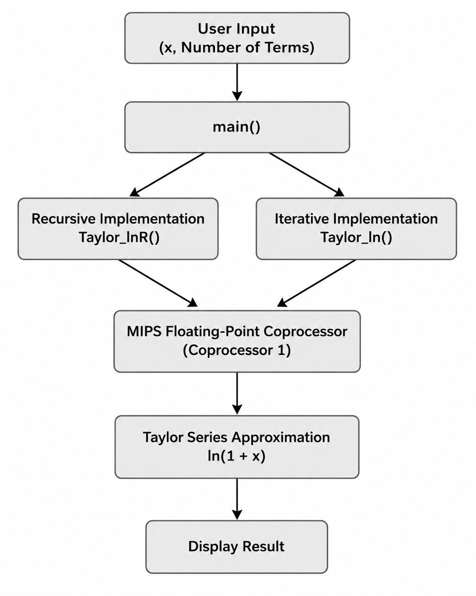

<div align="center">

# Taylor Series in MIPS Assembly

### Recursive and iterative approximation of ln(1+x) using the MIPS Floating-Point Coprocessor

**MIPS Assembly • Computer Architecture • Floating-Point Arithmetic**

</div>

---

## Overview

This project implements the Taylor series approximation of the natural logarithm function **ln(1+x)** using **MIPS Assembly**.

Two implementations are provided:

- An **iterative** implementation.
- A **recursive** implementation.

Both versions make extensive use of the **MIPS Floating-Point Coprocessor (Coprocessor 1)** for floating-point arithmetic while following standard MIPS procedure calling conventions.

The project demonstrates how mathematical algorithms can be translated into low-level assembly language while emphasizing recursion, floating-point computation, and modular procedure design.

---

## Features

- Recursive and iterative implementations of the Taylor series approximation
- MIPS Assembly implementation of **ln(1+x)**
- Floating-point arithmetic using **MIPS Coprocessor 1 (FPU)**
- Recursive procedure implementation
- Modular procedure organization
- Comparison with an equivalent C implementation
- Well-commented educational assembly code
- Designed for execution with **QtSpim**

---

## Repository Structure

```text
taylor-series-mips/
│
├── README.md
├── examples/
│   └── sample-output.txt
├── taylor_series.c
└── taylor_series.s
```

---

## Building and Running

### MIPS Assembly

1. Open **QtSpim**.
2. Load the `taylor_series.s` source file.
3. Assemble and run the program.

### C Reference Implementation

The accompanying C implementation (`taylor_series.c`) is provided for comparison with the MIPS implementation.

Compile using:

```bash
gcc taylor_series.c -o taylor_series
```

Run:

```bash
./taylor_series
```

---

## Mathematical Background

The natural logarithm function can be approximated using its Taylor series expansion:

\[
\ln(1+x)=\sum_{n=1}^{\infty}\frac{(-1)^{n+1}x^n}{n}, \qquad -1 < x \leq 1
\]

Since the infinite series cannot be evaluated exactly, the implementation approximates the function using a finite number of terms.

Both recursive and iterative approaches compute the same mathematical expression while demonstrating different implementation techniques in MIPS Assembly.

---

## Example

Example output:

```text
Value of x: 0.5
Number of terms: 20

Recursive approximation:
0.405465

Iterative approximation:
0.405465

C implementation:
0.405465
```

A complete execution example is available in:

```text
examples/sample-output.txt
```

---

## Architecture

<p align="center">
    
</p>

The application begins by receiving the input value (`x`) together with the number of Taylor series terms.

The `main()` procedure executes both the recursive and iterative implementations independently. Each implementation evaluates the Taylor series approximation of **ln(1+x)** using floating-point arithmetic provided by the **MIPS Floating-Point Coprocessor (Coprocessor 1)**.

Although the two implementations use different programming techniques, they perform the same mathematical computation and produce equivalent approximations for comparison and verification.

---

## Computer Architecture Concepts

This project demonstrates several fundamental computer architecture concepts, including:

- MIPS instruction set programming
- MIPS calling conventions
- Floating-point arithmetic using **Coprocessor 1 (FPU)**
- Floating-point register management
- Recursive procedure calls
- Stack frame management
- Register allocation
- Parameter passing
- Function return values
- Numerical computation in assembly language

---

## Implementation Details

The project consists of two independent MIPS implementations of the Taylor series approximation:

- An **iterative** implementation that computes each term sequentially.
- A **recursive** implementation that evaluates the series through recursive procedure calls.

Floating-point arithmetic is performed using MIPS Coprocessor 1 (FPU) instructions, while the accompanying C implementation serves as a reference for validating correctness and comparing the two implementations.

The code is designed for educational purposes, emphasizing readability, modularity, and understanding of low-level numerical computation.

---

## Educational Objectives

This project was developed to explore mathematical computation at the assembly language level.

Its primary educational objectives are to:

- Understand floating-point computation in MIPS Assembly
- Apply recursive and iterative programming techniques
- Gain practical experience with the MIPS Floating-Point Coprocessor
- Study procedure calls and parameter passing in assembly language
- Compare high-level and low-level implementations of the same mathematical algorithm

---

## Future Improvements

Possible extensions of this project include:

- Support for additional mathematical functions using Taylor series
- Performance comparison between recursive and iterative implementations
- Numerical error analysis for different numbers of Taylor series terms
- Comparison of approximation error against the standard C math library

---

## License

This project is licensed under the **MIT License**.

See the [LICENSE](../../LICENSE) file for details.

---

<div align="center">

**Developed by Anastasis Zachariou**

</div>
